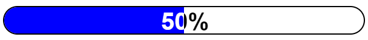

# React Progress Bar

A React Component that show processing of actions.

## Demo

[codesandbox](https://codesandbox.io/s/demo-react-progress-bar-3n5iyp)

[ghpages-example](https://developergovindgupta.github.io/react-progress-bar/)

[github-sourcecode](https://github.com/developergovindgupta/react-progress-bar)

## How to install

    npm install react-progress-bar

## How to import

    import ReactProgressBar from "react-progress-bar";

## How to use

    <ReactProgressBar progress={progressValue} width={300} />

## Props

|property|type|default value|Description|
|--|--|--|--|
|width|Number|300|width of progress bar in pixcel.|
|progress|Number|50|progressValue that shows in how much action is processed|
|color|String|'blue'|any valid color value of progress bar|
|style|Object||any style that you want to override of progress bar|

## Demo

[codesandbox](https://codesandbox.io/s/demo-react-progress-bar-3n5iyp)

[ghpages-example](https://developergovindgupta.github.io/react-progress-bar/)

[github-sourcecode](https://github.com/developergovindgupta/react-progress-bar)

# License Free to use

# Author

## developergovindgupta (Govind Prasad Gupta)

## Email : govindprasadguptamca@gmail.com 
